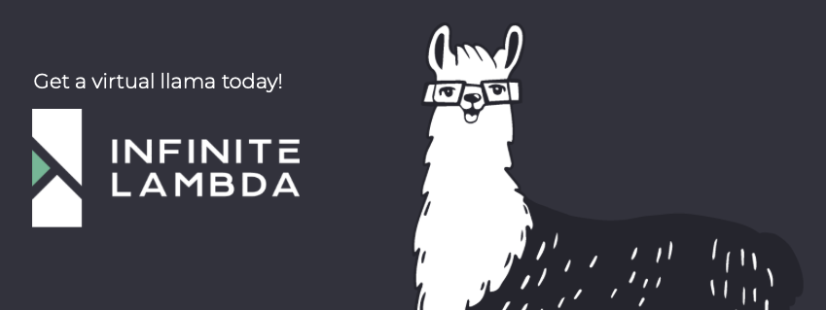

# :rocket: The Llama Fusion :llama:

                                        powered by dbt Fusion Engine

Welcome! This is a sandbox project that is cloned from dbt's Jaffle Shop. But instead of jaflles we sell... virtual :llama:

To get started:
1. Set up your database connection in `~/.dbt/profiles.yml`. If you got here by running `dbt init`, you should already be good to go.
2. Run `dbt build`. That's it!

> [!NOTE]
> If you're brand-new to dbt, we recommend starting with the [dbt Learn](https://learn.getdbt.com/) platform. It's a free, interactive way to learn dbt, and it's a great way to get started if you're new to the tool.